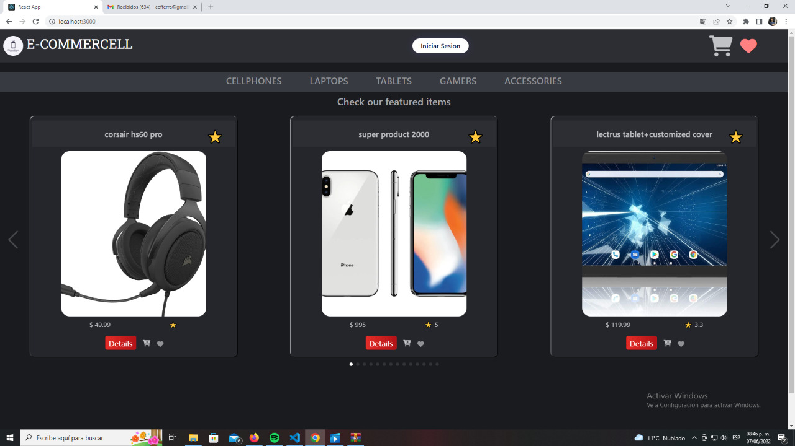
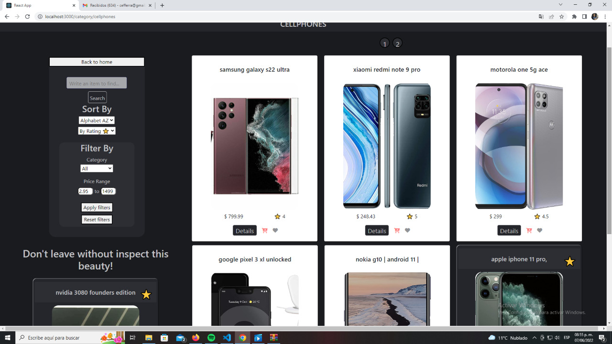
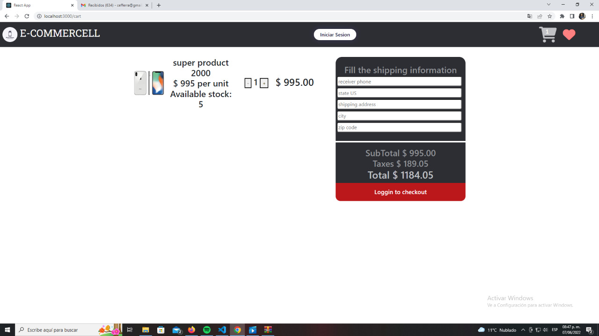
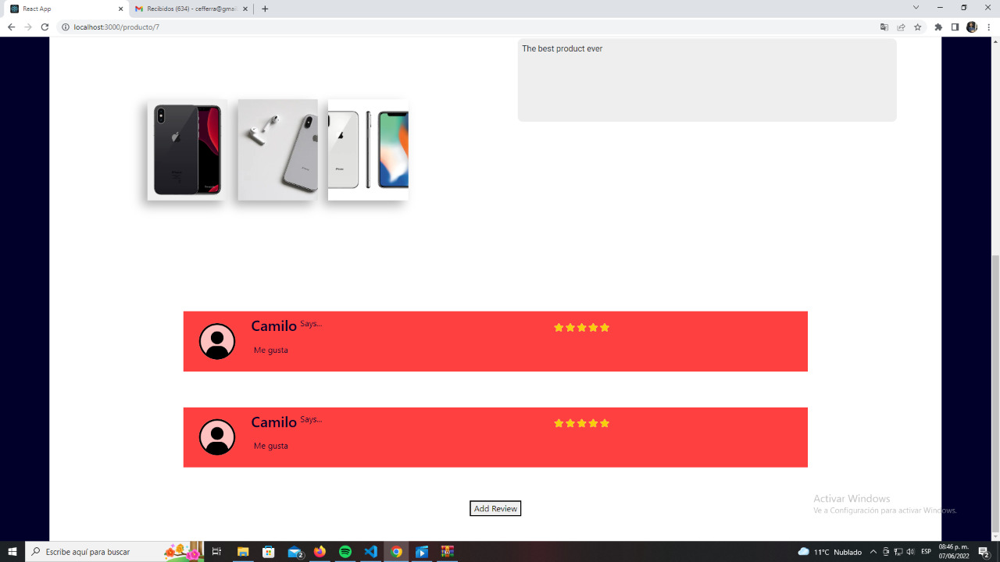
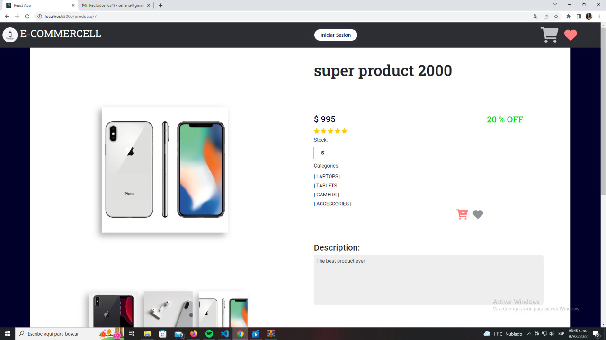
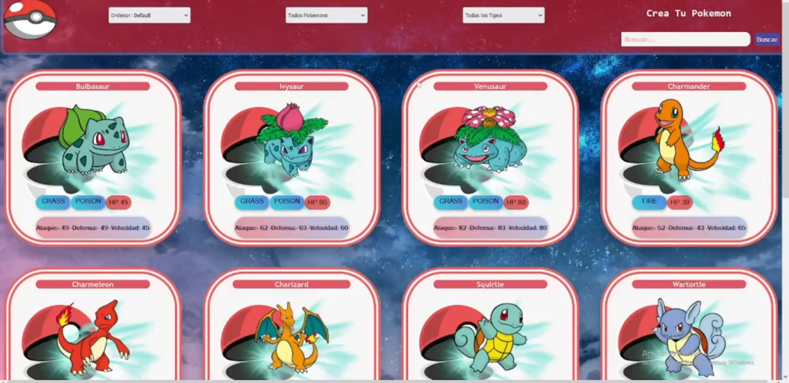
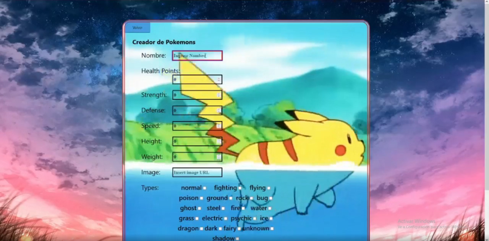
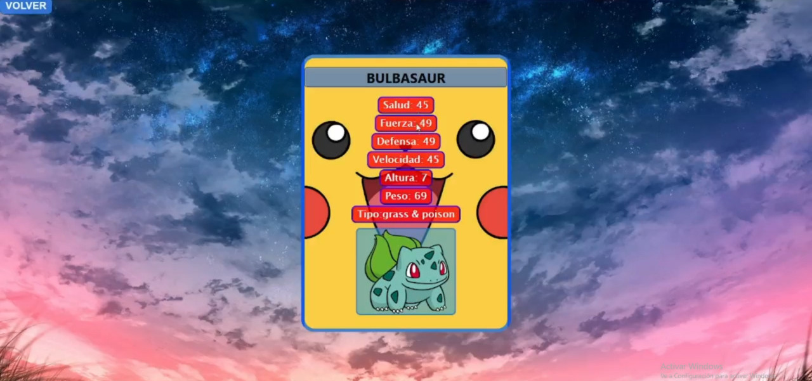

<h2 align="center">
Full Stack Developer :heart: from Argentina to :earth_americas:
</h2>

&nbsp;&nbsp;

## :star: Languages and Tools:

  <code></code>
  <code></code>
  <code></code>
  <code></code>
  <code></code>
  <code></code>
   
  <code></code>
  <code></code>
  <code></code>
  <code></code>
  <code></code>
  <code></code>
   

&nbsp;

## :pushpin: My proyects

<h3>E-commerce</h3>

  
  
 

  
  
  

<h3>Pokemons</h3>

  
  
  

 
&nbsp;

## :paperclip: How to reach me:

<a href="https://www.linkedin.com/in/cristian-ferraggina-924a1a1b8/" > &nbsp;
<a href="mailto:cefferra@gmail.com" >

